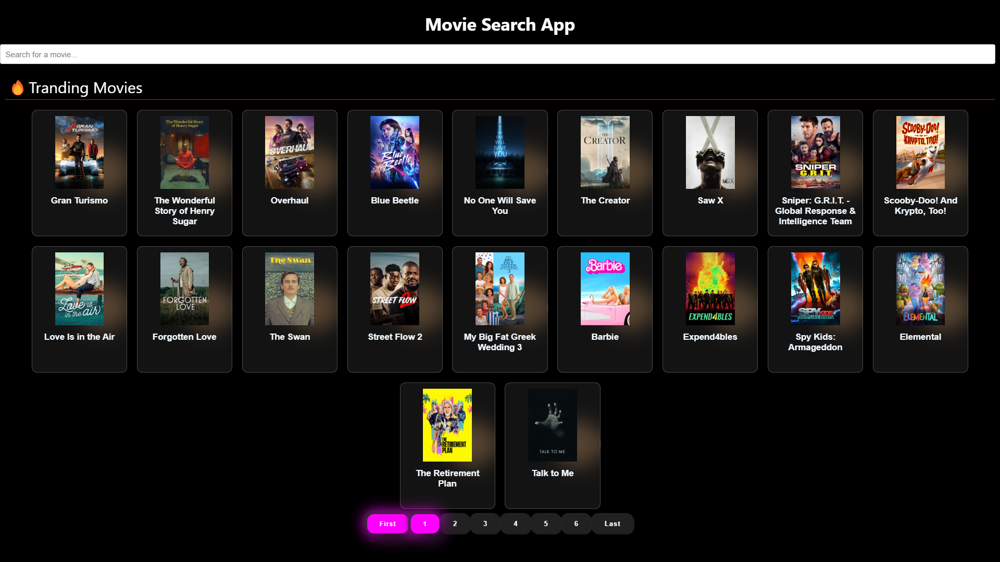

# Movie Search App

The Movie Search App is a web application that allows users to search for movies and view details about them. Users can search for movies by entering a query, and the app will display a list of matching movies. Users can also click on a movie to view more details about it.



## Live Demo

You can try the app live at [Movie Search App](https://react-find-movie.web.app/).

## Features

- **Movie Search:** Users can enter a search query, and the app will fetch and display a list of matching movies.
- **Movie Details:** Users can click on a movie to view additional details, including the movie poster, overview, and other information.
- **Pagination:** If the search results have multiple pages, the app provides pagination to navigate through the pages.
- **Error Handling:** The app handles errors gracefully and displays error messages to users if something goes wrong.
- **Default Image:** If a movie poster fails to load, a default image is displayed.

## Technologies Used

- React: A JavaScript library for building user interfaces.
- Redux: A state management library for managing the application's global state.
- Redux Toolkit: A set of tools and libraries to simplify Redux setup and usage.
- CSS Modules: A CSS approach that allows for scoped styles in React components.
- The Movie Database (TMDb) API: Used to fetch movie data.

## Installation

1. Clone this repository to your local machine:

   ```bash
   git clone <repository-url>
   ```

2. Navigate to the project directory:

   ```bash
   cd movie-search-app
   ```

3. Install the project dependencies:

   ```bash
   npm install
   ```

4. Create a `.env` file in the project root and add your TMDb API key:

   ```env
   REACT_APP_API_KEY=your-api-key-here
   REACT_APP_TRANDING_URL="https://api.themoviedb.org/3/trending/movie/day?language=en-US&page="
   REACT_APP_SEARCH_URL="https://api.themoviedb.org/3/search/movie"
   ```

   Replace `your-api-key-here` with your actual TMDb API key.

5. Start the development server:

   ```bash
   npm start
   ```

6. Open your web browser and access the app at `http://localhost:3000`.

## Usage

1. Enter a movie title or keyword in the search input and press the "Search" button.
2. Browse through the list of movies that match your search.
3. Click on a movie to view more details.
4. To close the movie details overlay, click the "Close" button.

## Contributing

Contributions are welcome! If you would like to contribute to this project, please follow these steps:

1. Fork the repository.
2. Create a new branch for your feature or bug fix: `git checkout -b feature-name`.
3. Make your changes and commit them: `git commit -m "Description of your changes"`.
4. Push your changes to your fork: `git push origin feature-name`.
5. Create a pull request, explaining your changes and why they should be merged.
